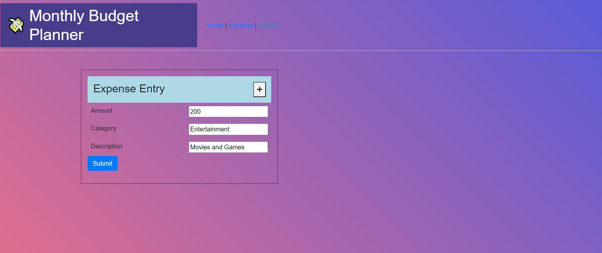
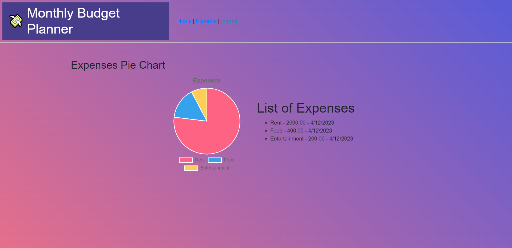

# Budget Builder

## Description

This application is built to help people track their expenses throughout the month. By tracking expenses throughout the month, this information can be used in budgeting for the next month as well as identifying potential savings by eliminating inessential expenses.

## Technologies Used

This application is built using HTML, CSS, JavaScript, Handlebars.js, Express.js, and Chart.js

To learn more about Handlebars.js visit: https://handlebarsjs.com/
To learn more about Chart.js visit: https://www.chartjs.org/

## Application Links

Deployed Heroku Application: https://countzachula.herokuapp.com/

GitHub Repo: https://github.com/SaintOfMirren/Budget-Builder

## Application Screenshots

## Future Development

-Improve responsiveness
-Add income vs expense tracking bar
-Create drop down menus for choosing categories
-Add clear and delete buttons for each entry
-Add the ability to filter or sort by date or category